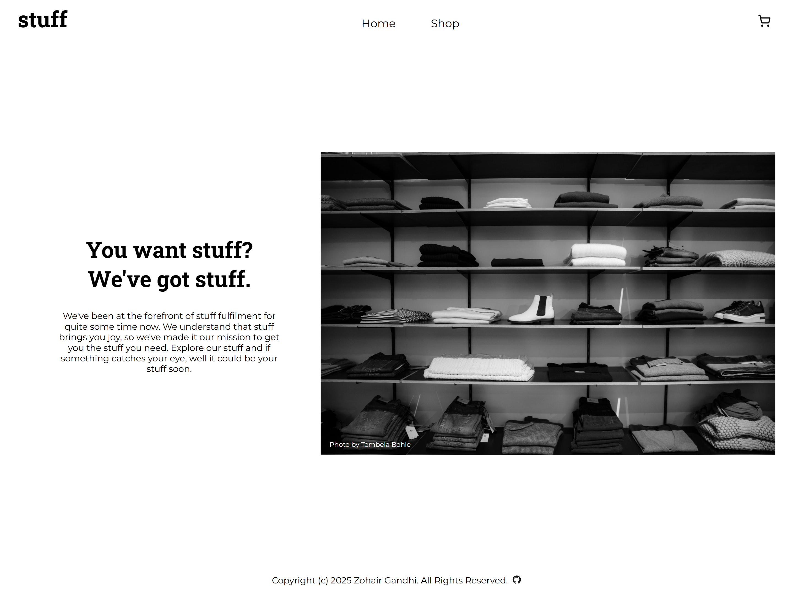
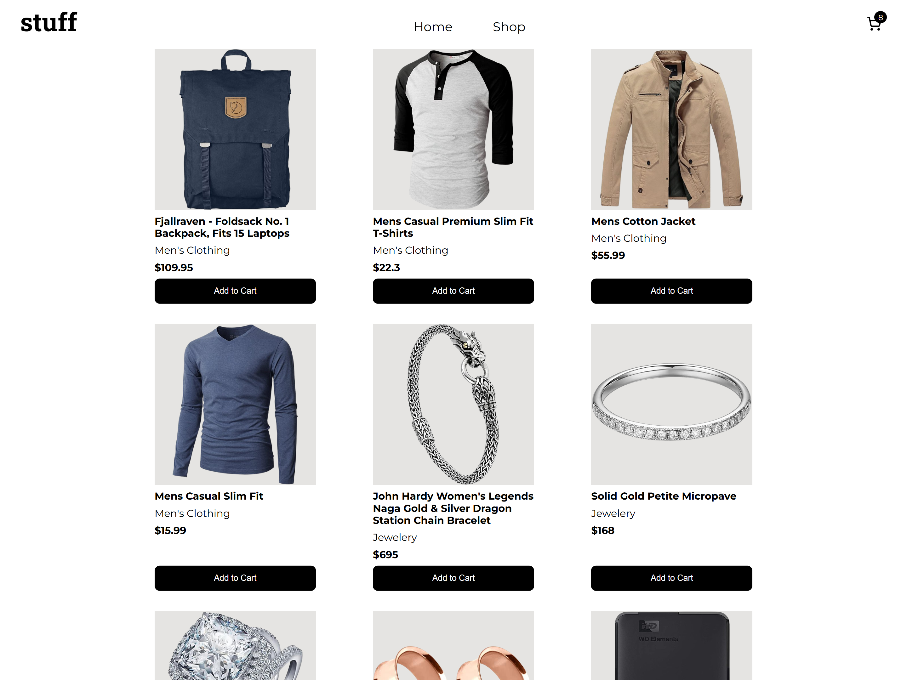
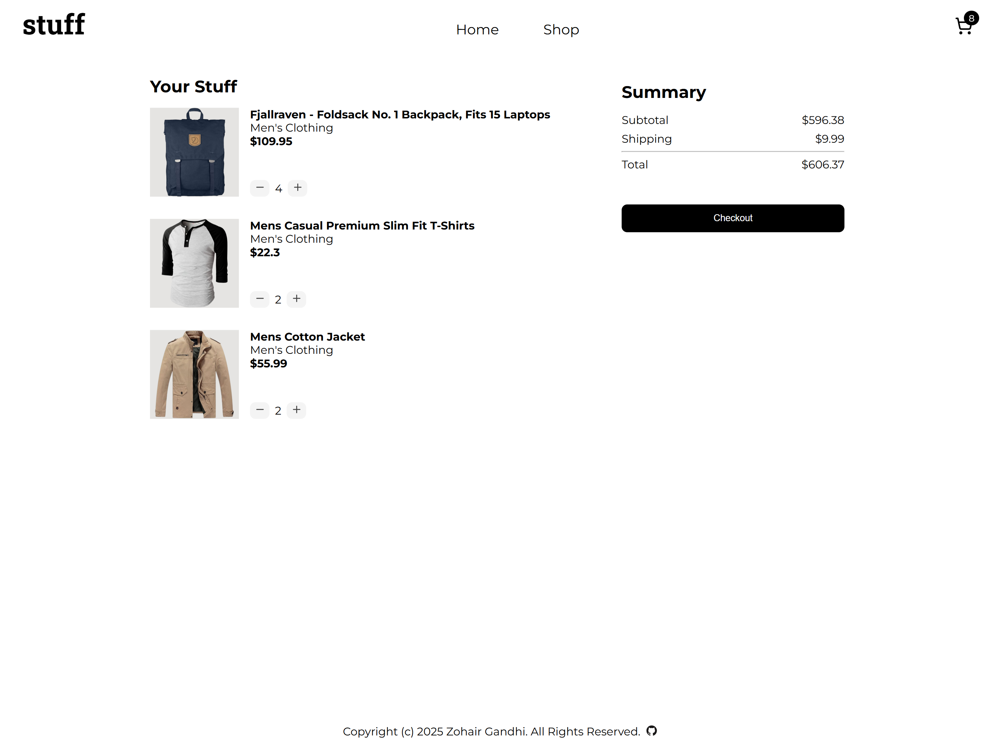

# Shopping Cart

A simple single-page shopping cart application built with React. Users can
browse products, add them to a cart, and navigate between the Home, Shop, and
Cart pages, all within a smooth client-side rendering using React Router.





## Built With

- Vite - For fast development and building the application
- React - For building UI
- React Router - For client-side routing, enabling navigation between pages
  without full page reloads
- styled-components - For styling React components
- FakeStore API - To simulate product data
- PropTypes - For type checking

## Live Demo

Check out the
[live version of the app on Netlify](https://zingy-raindrop-11c051.netlify.app/)

## Installation

Follow these steps to run the project locally:

1. Clone the repository

```bash
git clone https://github.com/ZohairGandhi/shopping-cart.git
cd shopping-cart
```

2. Install dependencies

```bash
npm install
```

3. Build for production

```bash
npm run build
```

4. Locally preview production build

```bash
npm run preview
```

5. Open in your browser

Visit `http://localhost:4173` (or whatever port Vite shows in your terminal)
